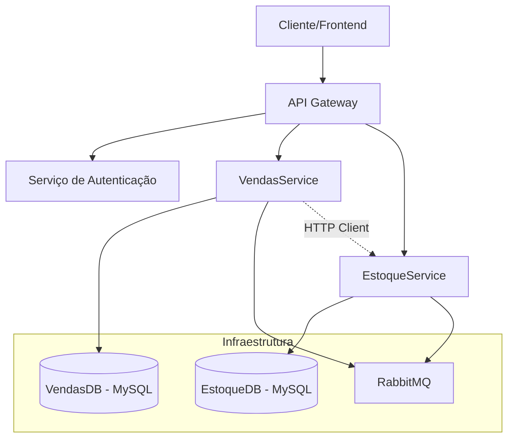
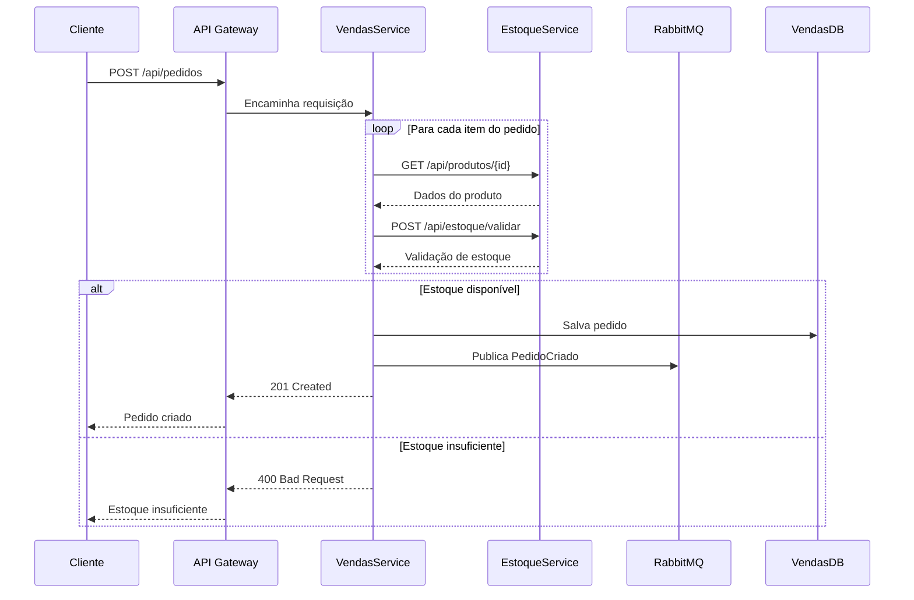

# EcommerceMicroservices

Sistema de e-commerce baseado em arquitetura de microsserviços desenvolvido em .NET 8, implementando padrões modernos de desenvolvimento como API Gateway, comunicação assíncrona com RabbitMQ, autenticação JWT e logging estruturado.

## 🏗️ Arquitetura do Sistema



## 🚀 Microsserviços

### 1. API Gateway
- **Porta**: 7001
- **Responsabilidade**: Roteamento de requisições, autenticação centralizada
- **Tecnologias**: Ocelot, Swagger

### 2. EstoqueService
- **Porta**: 7145
- **Responsabilidade**: Gerenciamento de produtos e estoque
- **Banco de dados**: MySQL
- **Funcionalidades**:
  - CRUD de produtos
  - Validação de estoque
  - Atualização de quantidades

### 3. VendasService
- **Porta**: 7246
- **Responsabilidade**: Gerenciamento de pedidos e vendas
- **Banco de dados**: MySQL
- **Funcionalidades**:
  - Criação de pedidos
  - Validação com EstoqueService
  - Publicação de eventos via RabbitMQ

## 📊 Fluxo de Criação de Pedido



## 🛠️ Tecnologias Utilizadas

### Backend
- **.NET 8**: Framework principal
- **Entity Framework Core**: ORM
- **MySQL**: Banco de dados
- **RabbitMQ**: Message broker
- **JWT**: Autenticação e autorização
- **Serilog**: Logging estruturado
- **Swagger/OpenAPI**: Documentação da API

### Infraestrutura
- **Ocelot**: API Gateway
- **Docker**: Containerização (preparado)
- **CORS**: Política de origem cruzada

## 📁 Estrutura do Projeto

```
EcommerceMicroservices/
├── ApiGateway/                 # Gateway de APIs com Ocelot
│   ├── ocelot.json            # Configuração de rotas
│   ├── swaggerendpoints.json  # Endpoints do Swagger
│   └── Program.cs
├── EstoqueService/            # Microsserviço de Estoque
│   ├── Controllers/           # Controllers da API
│   ├── Data/                  # Contexto do EF Core
│   ├── Models/                # Modelos de dados
│   ├── Consumers/             # Consumidores RabbitMQ
│   └── Program.cs
├── VendasService/             # Microsserviço de Vendas
│   ├── Controllers/           # Controllers da API
│   ├── Data/                  # Contexto do EF Core
│   ├── Models/                # Modelos de dados
│   ├── Services/              # Serviços de negócio
│   ├── Middleware/            # Middlewares customizados
│   └── Program.cs
└── Shared.Messages/           # Biblioteca compartilhada de mensagens
    └── Events/                # Eventos para RabbitMQ
```

## ⚙️ Configuração e Execução

### Pré-requisitos
- .NET 8 SDK
- MySQL Server
- RabbitMQ Server
- Visual Studio 2022 ou VS Code

### 1. Clone o repositório
```bash
git clone <repository-url>
cd EcommerceMicroservices
```

### 2. Configure as bases de dados

#### MySQL - VendasService
```json
"ConnectionStrings": {
  "DefaultConnection": "Server=localhost;Port=3306;Database=VendasDB;User=root;Password=root8790;"
}
```

#### MySQL - EstoqueService
```json
"ConnectionStrings": {
  "DefaultConnection": "Server=localhost;Port=3306;Database=EstoqueDB;User=root;Password=root8790;"
}
```

### 3. Configure o RabbitMQ
```json
"RabbitMQ": {
  "HostName": "localhost",
  "Port": "5672",
  "UserName": "guest",
  "Password": "guest"
}
```

### 4. Execute os serviços

#### Opção 1: Via Visual Studio
1. Configure múltiplos projetos de inicialização
2. Selecione: ApiGateway, EstoqueService, VendasService
3. Execute (F5)

#### Opção 2: Via linha de comando
```bash
# Terminal 1 - EstoqueService
cd EstoqueService
dotnet run

# Terminal 2 - VendasService  
cd VendasService
dotnet run

# Terminal 3 - ApiGateway
cd ApiGateway
dotnet run
```

## 🔧 Endpoints Principais

### API Gateway (https://localhost:7001)
- **Swagger**: `/swagger`
- **Produtos**: `/estoque/api/produtos`
- **Pedidos**: `/vendas/api/pedidos`

### EstoqueService (https://localhost:7145)
- `GET /api/produtos` - Lista produtos
- `POST /api/produtos` - Cria produto
- `PUT /api/produtos/{id}` - Atualiza produto
- `POST /api/estoque/validar` - Valida estoque

### VendasService (https://localhost:7246)
- `GET /api/pedidos` - Lista pedidos
- `POST /api/pedidos` - Cria pedido
- `GET /api/pedidos/{id}` - Busca pedido
- `PUT /api/pedidos/{id}/status` - Atualiza status

## 🔐 Autenticação

O sistema utiliza JWT Bearer Token. Configure o token no header:
```
Authorization: Bearer <seu-jwt-token>
```

### Configuração JWT
```json
"Jwt": {
  "Key": "ChaveSuperSecretaParaJWTTokenSeguro@2025!",
  "Issuer": "VendasAPI",
  "Audience": "VendasAPI"
}
```

## 📝 Logging

Todos os serviços utilizam Serilog com saídas para:
- **Console**: Para desenvolvimento
- **Arquivo**: `logs/{service}-service-.log`

## 🔄 Comunicação entre Serviços

### Síncrona
- VendasService → EstoqueService (HTTP Client)
- Validação de produtos e estoque

### Assíncrona  
- Eventos via RabbitMQ
- Padrão Publisher/Subscriber
- Desacoplamento entre serviços

## 🐳 Docker (Em desenvolvimento)

```bash
# Build
docker-compose build

# Run
docker-compose up -d
```

## 📈 Monitoramento

- **Health Checks**: Implementados em todos os serviços
- **Logging estruturado**: Serilog com formato JSON
- **Métricas**: Preparado para integração com Prometheus

## 🤝 Contribuição

1. Fork o projeto
2. Crie uma branch para sua feature (`git checkout -b feature/AmazingFeature`)
3. Commit suas mudanças (`git commit -m 'Add some AmazingFeature'`)
4. Push para a branch (`git push origin feature/AmazingFeature`)
5. Abra um Pull Request

## 📄 Licença

Este projeto está sob a licença MIT. Veja o arquivo [LICENSE](LICENSE) para detalhes.

## 👥 Autor

- **Vando Ramos** - *Desenvolvimento inicial* - [GitHub](https://github.com/vcr1985)

## 📞 Suporte

Para dúvidas ou suporte, abra uma issue no repositório ou entre em contato através do email: ramosvando@gmail.com
